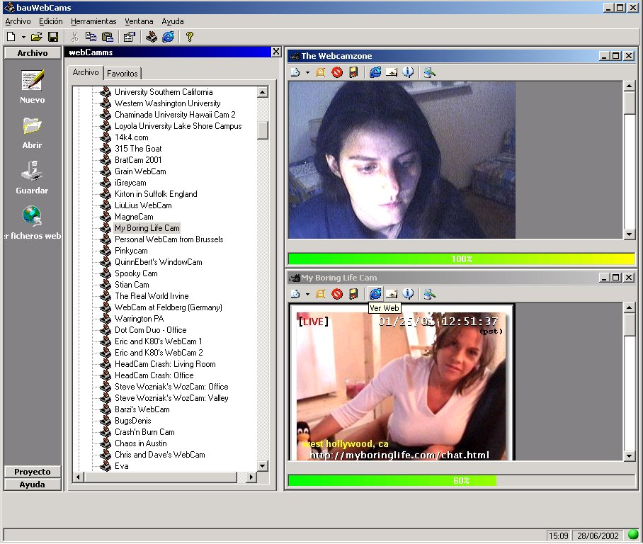



## bauWebCam

### Description

See webCamms over the world. Lets add webcams and parameters, see various webCams at time, save the images, create avi, e-mail owner web cam. In next versions I want let chat while see webCam and upload the image of the webcam. Examples with More than 1.000 cams (files dxml).

CORRECTED WITHOUT OCX.

I'm sorry my bad English, I'm spanish. Please, e-mail me with your suggestions, ideas, etc...
 
### More Info
 

             |
---                |---
**Submitted On**   |2002-07-01 11:47:10
**By**             |[Jose Antonio](https://github.com/Planet-Source-Code/PSCIndex/blob/master/ByAuthor/jose-antonio.md)
**Level**          |Intermediate
**User Rating**    |4.6 (65 globes from 14 users)
**Compatibility**  |VB 6\.0
**Category**       |[Complete Applications](https://github.com/Planet-Source-Code/PSCIndex/blob/master/ByCategory/complete-applications__1-27.md)
**World**          |[Visual Basic](https://github.com/Planet-Source-Code/PSCIndex/blob/master/ByWorld/visual-basic.md)
**Archive File**   |[bauWebCam100500712002\.zip](https://github.com/Planet-Source-Code/jose-antonio-bauwebcam__1-36428/archive/master.zip)

